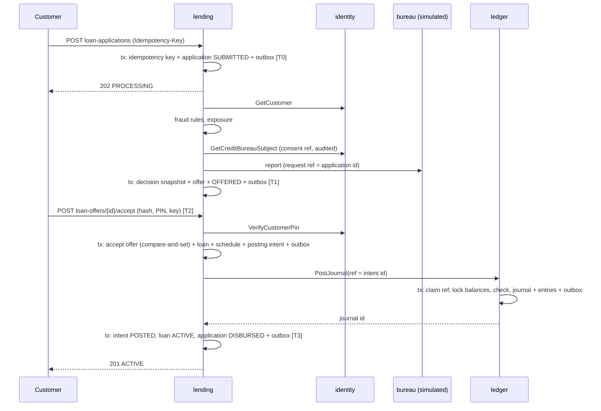
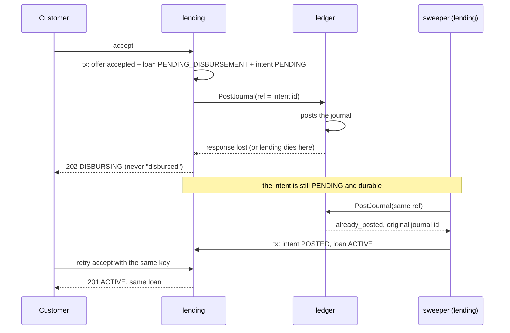

# Review package: personal loans

Product 1 of 7. This document is for the engineer reviewing the implementation before the next product is started.

**Gate status: the implementation gate is met. The launch gate is not.** The product works end to end, with its invariants enforced and tested, against simulated providers on a developer machine. It cannot be launched: every external integration runs against a simulator (the one production adapter, for Paystack, has never been run against Paystack), nothing is deployed, and several legal and security prerequisites are open ([LAUNCH_DEPENDENCIES.md](LAUNCH_DEPENDENCIES.md)).

"No mistakes" is an aim, not a claim. What supports confidence here is listed in section 10; what is known to be missing is in section 15. Five defects were found by the tests and by running the system while building it, and are listed in section 10 because they show which checks are doing real work.

---

## 1. Implemented user journeys

| Journey | Entry point |
|---|---|
| Register and sign in (BVN checked over HTTP by the provider simulator) | `POST /v1/customers`, `POST /v1/sessions` (identity) |
| Apply for a loan | `POST /v1/loan-applications` |
| Automated assessment: KYC, fraud screen, credit report, policy → offer, decline, or referral | background worker |
| Manual review of referred applications | `/v1/ops/manual-reviews` |
| View and accept an offer (disclosure hash + PIN) | `POST /v1/loan-offers/{id}/accept` |
| Disbursement to the customer's deposit account | posting intent → ledger |
| Optional payout to the customer's own external account | payout driver, callbacks, status queries |
| Repay: partial, full, early settlement | `POST /v1/loans/{id}/repayments` |
| Repay from outside the bank, credited only after the provider confirms | `POST /v1/loans/{id}/external-repayments`, `POST /v1/provider-webhooks/payments`, payment driver |
| Scheduled collection from the customer's own account | `CollectDue` |
| Daily interest accrual, arrears classification, late fee | `RunDailyJobs` |
| Restructure, write-off (two people), recovery | `/v1/ops/admin-actions` |
| Statement, payoff quote, portfolio report | `GET` endpoints |
| Reconciliation against the ledger and the payout provider | `ReconcileLedger`, `ReconcilePayouts` |

## 2. Mapping to the architecture plan

Full table: [docs/TRACEABILITY.md](../TRACEABILITY.md).

**Departures from the plan**, each with a decision record:

| Plan | Implemented | Record |
|---|---|---|
| Gateway in front of all services | Each service serves its own REST API | [ADR 0002](../adr/0002-rest-per-service-gateway-deferred.md) |
| Payments, risk and recon services | Their loan-specific parts live in lending behind ports | [ADR 0005](../adr/0005-external-payout-inside-lending.md) |
| SQS for background jobs; Redis for rate limits | Neither introduced yet | [ADR 0006](../adr/0006-kafka-sqs-redis.md) |
| Prepayment re-amortises the schedule | Full early settlement only | [PRODUCT_RULES.md](PRODUCT_RULES.md) |
| Loan states include `RESTRUCTURED` | A flag on the loan; states stay `ACTIVE` / `IN_ARREARS` | — |
| System-account striping | Deferred, with measurements | [ADR 0010](../adr/0010-hot-accounts-deferred.md) |
| Ledger DDL | Added `journal_types` (per-journal-type shape policy) | [ADR 0003](../adr/0003-ledger-invariants.md) |

**The plan itself is incomplete.** Sections 9–18 were never delivered. Loans depend on sections 0–8 only; where those were silent (Kafka conventions, API conventions) the choices are recorded in the ADRs and contracts.

## 3. Directory and ownership

```
services/ledger     owns: accounts, journals, entries, balances, holds      (database: ledger)
services/identity   owns: customers, KYC status, credentials, staff         (database: identity)
services/lending    owns: applications, decisions, offers, loans,            (database: lending)
                          schedules, repayments, payouts, exceptions
platform/           money, bizdate, config, pgxutil, migrate, outbox, kafkax,
                    grpcx, devcert, authn, httpx, obs, lifecycle
```

Size: about 17,700 lines of Go excluding tests and generated code, 6,500 lines of tests, 800 lines of SQL.

## 4. Key decisions and trade-offs

| Decision | Gain | Cost |
|---|---|---|
| Balances written only by a database trigger | The application cannot make balances drift from entries | Logic in the database; trigger overhead per entry |
| Posting intents (ADR 0004) | Every lending→ledger movement survives a crash at any point and posts once | One in-flight posting per loan: concurrent operations get `OPERATION_IN_PROGRESS` |
| Disburse inside the accept request, with the sweeper as backup | The customer normally has the money when the call returns | The request waits on the ledger (median 56 ms measured locally) |
| Loan booked to the deposit account first; external payout is separate | A payout failure never un-disburses a loan | Two steps for customers who want the money elsewhere |
| Timeout = unknown; funds held until evidence | No double payment, no refund of money that left | Funds can sit held; needs the provider's status query and report to be reliable |
| Interest fixed per period, earned daily | Exact to the kobo; no rounding residue; simple early-settlement rule | Paying ahead within a period does not reduce that period's interest |
| Decline before the bureau when already ineligible | No enquiry footprint or cost for loans that cannot be made | — |
| mTLS in tests | The authorisation path that runs in production is the one tested | Tests issue certificates |

## 5. Schema and migrations

| Database | Migration | Notable constraints |
|---|---|---|
| ledger | [00001_ledger_core.sql](../../services/ledger/migrations/00001_ledger_core.sql), [00002_loans_chart_and_rights.sql](../../services/ledger/migrations/00002_loans_chart_and_rights.sql) | Deferred balanced-journal trigger; immutability triggers; `CHECK (posted - held >= floor)`; `posting_refs` primary key; column-level grants |
| identity | [00001_identity_core.sql](../../services/identity/migrations/00001_identity_core.sql) | Unique phone and BVN fingerprint; BVN stored as HMAC + AES-GCM; append-only audit log |
| lending | [00001_lending_core.sql](../../services/lending/migrations/00001_lending_core.sql) | One open application per customer and product; one live offer per application; one loan per application and per offer; one pending posting per loan; `paid <= due` on instalments; maker ≠ checker; an `ACTIVE` loan must have a journal |

Migrations run as an owner role in a separate step (`<service>d migrate`); services connect as an application role without DDL rights. They were applied from scratch in every integration test and once against the local compose database.

## 6. Contracts

- REST: [lending-rest.md](../contracts/lending-rest.md)
- gRPC: [ledger-grpc.md](../contracts/ledger-grpc.md), [identity-grpc.md](../contracts/identity-grpc.md); definitions in [proto/](../../proto/)
- Events: [events.md](../contracts/events.md)
- Simulator: [provider-simulator.md](../contracts/provider-simulator.md)

Why each hop is synchronous or asynchronous:

| Interaction | Style | Reason |
|---|---|---|
| lending → ledger | gRPC | Lending needs the answer to decide its next step; the ledger is the authority on whether money may move |
| lending → identity | gRPC | KYC status must be current at the moment of decision |
| identity → ledger (open account) | gRPC, completed in the background if it fails | One idempotent call |
| ledger → lending (money arrived) | Kafka | A reaction to a committed fact; must not block the posting; other consumers will want it |
| lending → providers | HTTP with deadlines | External |

The longest synchronous chain is one hop. The ledger calls nothing.

## 7. Successful path



## 8. Failure and recovery



External payout with an unknown outcome:

```mermaid
sequenceDiagram
  participant L as lending
  participant G as ledger
  participant P as payout provider (simulated)
  L->>G: PlaceHold(ref = payout id)
  L->>L: state SENDING (recorded before the call)
  L->>P: send(reference)
  P--xL: timeout
  L->>L: state UNKNOWN, hold stays, customer sees PROCESSING
  loop backoff
    L->>P: query(reference)
  end
  alt SUCCESS
    L->>G: CaptureHold
    L->>L: SUCCEEDED
  else FAILED
    L->>G: ReleaseHold
    L->>L: FAILED
  else still nothing
    L->>L: exception after 30 min; settlement report is the arbiter
  end
```

## 9. Accounting entries and invariants

Bank's perspective. Amounts from the illustrative product: ₦100,000 over 3 months at 4% a month, 1% fee.

| Event | Debit | Credit |
|---|---|---|
| Disbursement | Loans receivable – principal 100,000.00 | Customer deposit 99,000.00; Fee income 1,000.00 |
| Daily accrual (aggregate) | Loan interest receivable | Interest income |
| Repayment of instalment 1 | Customer deposit 36,034.85 | Loan interest receivable 4,000.00; Loans receivable – principal 32,034.85 |
| Late fee | Loan fees receivable 500.00 | Fee income 500.00 |
| Write-off | Write-off expense | Principal, interest and fees receivable outstanding |
| Recovery | Customer deposit | Recoveries income |
| Payout capture | Customer deposit | Payout clearing |
| Payout settlement | Payout clearing | Cash at settlement bank |

Where each invariant is enforced: [ADR 0003](../adr/0003-ledger-invariants.md). After every scenario the tests assert: every journal balances; every balance equals the sum of its entries; held equals active holds; the trial balance is zero; the loan book equals the ledger control accounts; and each posting lending recorded exists in the ledger with the same lines.

## 10. Tests run and results

Commands, run on 1 October 2026 on macOS (Intel, 8 cores), Go 1.27.1, PostgreSQL 16, Kafka 3.9 and Redis 7 in Docker, on the final code:

| Command | Result |
|---|---|
| `make lint` (gofmt, `go vet`, staticcheck 2026.2.1, `buf lint`) | Clean |
| `make vuln` (govulncheck) | 1 reachable advisory, `GO-2026-6443` in gRPC 1.84.0, no tagged fix; accepted with expiry 15 Nov 2026 and a written reason |
| `go test ./...` | Exit 0 |
| `make test` (`REQUIRE_INTEGRATION=1 go test -race -count=1 -timeout 20m ./...`) | Exit 0; all 18 packages with tests `ok` (identity 38 s, ledger 52 s, lending 239 s) |
| `promtool check rules deploy/prometheus/alerts.yml` | 18 rules valid |
| `npx newman run docs/postman/personal-loans.postman_collection.json -e docs/postman/local.postman_environment.json` against the four local processes | 48 requests (more when a poll repeats), 81 assertions, 0 failed |
| `ledgerd verify` after the local runs and the benchmark | All six counters zero |

177 test functions. None is skipped. Integration tests use real PostgreSQL, real gRPC over mTLS, real Kafka, real Redis, and the provider simulator over HTTP; only time and injected ledger faults are artificial. The Paystack adapter's tests run against a local HTTP server that returns the shapes its OpenAPI specification describes; nothing was run against Paystack.

**History.** An earlier single full run ended with one failure: the idempotent-replay race in the table below. After the fix that test passed 25 consecutive runs and the suite passed three times over. The suite has since passed in full after each of: the restructuring into smaller files, the HTTP identity adapter, external repayments, rate limiting and the Paystack adapter.

**Defects found during the build by tests or by running the system:**

| Found by | Defect | Fix |
|---|---|---|
| Property test over random repayment sequences | After early settlement an instalment's interest was "earned" on the old daily profile, so interest paid exceeded interest entitled | Settlement freezes the instalment at what was earned |
| Reconciliation in the write-off test | The loan-book total still counted loans that had been written off and later fully recovered | Excluded written-off loans from the control total |
| gRPC concurrency-limit test | The per-connection HTTP/2 stream cap made overloaded calls queue silently instead of being shed | Cap raised above the global limiter |
| Starting the real binaries | Telemetry setup failed on a schema-URL conflict; no service could start. Unit tests had not covered it | Schemaless resource; a test now covers `obs.Setup` |
| Full-suite run (intermittent) | Two concurrent accept requests with the same idempotency key: one could receive `OFFER_NOT_OPEN` instead of the replayed loan | Re-check the key before refusing; re-ran 25 times |
| Test of a callback that carries no outcome | A notification with no body wrote NULL to a NOT NULL column | Empty payloads are stored as empty, not NULL |
| Reading the logs of the running service | Every access-log line had route `/`: the router nested a second multiplexer behind a wrapper that copied the request | All routes on one multiplexer; verified in the log |

**Not run:** the CI workflow on a CI runner; any test against a real provider (including Paystack); any failover of a real replica; any load test on production-shaped infrastructure.

## 11. Performance observations

`cmd/loanbench`: register → apply → poll for decision → accept, against the four local processes. **Providers are simulated and answer in microseconds, on loopback.** These numbers show the platform's own overhead on one laptop. They are not production figures; a real bureau is budgeted 25 s in the plan.

| Concurrency | Journeys | Decision (T0→T1) p50 / p95 / p99 | Disbursement (T2→T3) p50 / p95 / p99 | System time p50 / p95 / p99 |
|---|---|---|---|---|
| 1 | 60 | 21 / 33 / 35 ms | 56 / 72 / 75 ms | 80 / 104 / 105 ms |
| 4 | 120 | 33 / 51 / 62 ms | 84 / 116 / 157 ms | 117 / 168 / 193 ms |
| 16 | 200 | 131 / 494 / 545 ms | 276 / 641 / 1,015 ms | 411 / 1,016 / 1,476 ms |
| 32 | 320 | 195 / 436 / 534 ms | 518 / 1,670 / 2,499 ms | 748 / 1,815 / 2,684 ms |

All 700 journeys completed; no errors were logged; all ledger invariant gauges read zero afterwards. Throughput levelled at about 22–25 journeys per second.

Re-measured on the final code (rate limiting on, HTTP identity adapter): 200 journeys at concurrency 1: system time p50 98 ms, p95 169 ms, p99 215 ms; 400 journeys at concurrency 16: p50 463 ms, p95 777 ms, p99 1.37 s; 0 failures. The laptop was also running other work, so small differences from the table above are not significant.

What limits it:

- **Ledger hot rows.** Mean posting time was 7.4 ms uncontended and 99 ms at concurrency 16: every disbursement locks the same two system-account rows. This is the contention the plan predicted. It is not addressed, because loan volume is far below the ceiling ([ADR 0010](../adr/0010-hot-accounts-deferred.md)).
- **PIN hashing.** Three argon2id computations per journey (register, sign in, step-up) are CPU-bound by design.

Backlog recovery: 40 pending disbursements drained by four concurrent sweepers in about 1.1 s, one journal each.

Query plans for the work-queue and uniqueness queries were inspected on the benchmark database and use their partial indexes. With only 700 loans the planner still chooses sequential scans for some lookups; plans have not been examined at realistic volume.

No caching and no sharding were introduced.

## 12. Security and regulatory controls

| Control | Where |
|---|---|
| Customer authentication | Ed25519 tokens, 15 minutes; lockout enforced under a row lock (tested against parallel guessing) |
| Step-up at acceptance | PIN verified by identity; never stored, logged or hashed into the idempotency record |
| Resource authorisation | Owner-scoped queries; foreign ids return 404 |
| Staff authorisation | Roles; maker ≠ checker in code and as a database constraint |
| Service-to-service | mTLS required; workload identity from the certificate; per-caller, per-journal-type rights |
| Callback authentication | HMAC over timestamp and raw body, constant-time compare, five-minute window, event-id deduplication |
| Sensitive data | BVN stored as keyed hash plus ciphertext; released only to lending with a consent reference, audited in the same transaction; absent from events, logs and metric labels (tested for events and the review queue) |
| Data minimisation | Application collects amount, tenor, income and consent; unknown JSON fields are rejected |
| Evidence | Disclosure hash, acceptance evidence, decision snapshots, raw bureau responses with hashes, append-only audit logs |
| Fail closed | Identity or bureau unavailable: no decision. Ledger unavailable: no disbursement. Simulator selected outside local/test: no start |

Regulatory position: the plan's compliance matrix was built from secondary reporting and none of it was verified against primary texts. No regulatory threshold is encoded in this code. Tier limits and the reported new-account cap are **not enforced** and are listed as launch dependencies. This implementation does not establish compliance with anything.

## 13. Reproduce locally

```bash
make tools infra-up dev-setup migrate topics
make run-ledger     # terminal 1
make run-sim        # terminal 2
make run-identity   # terminal 3
make run-lending    # terminal 4
./scripts/local-scenario.sh
make test
make bench
```

`local-scenario.sh` was run during the build: it registered a customer, obtained an offer (₦100,000; ₦1,000 fee; 4% monthly; ₦36,034.85 instalment; effective annual cost 70.2%), accepted it, replayed the acceptance with the same key and received the same loan, settled early (₦100,000 taken of ₦104,000 offered, no interest on day zero), and `ledgerd verify` reported zero violations.

## 14. Dashboards and runbooks

- Alerts: [deploy/prometheus/alerts.yml](../../deploy/prometheus/alerts.yml) (15 rules, validated with promtool)
- Dashboard: [deploy/grafana/personal-loans.json](../../deploy/grafana/personal-loans.json) (18 panels; not loaded into a Grafana instance)
- Runbooks: [docs/runbooks/](../runbooks/README.md)

Signals asked for, and the metric that carries each:

| Signal | Metric |
|---|---|
| Loan decision latency | `loan_decision_seconds`, `loan_assessment_stage_seconds` |
| Application-to-disbursement latency | `loan_system_time_seconds`, `loan_accept_to_disbursed_seconds` |
| Disbursement pending age | `loan_disbursement_oldest_pending_seconds` |
| Unknown provider outcomes | `loan_payout_unresolved`, `loan_payout_oldest_unresolved_seconds` |
| Duplicate-operation prevention | `loan_duplicate_postings_prevented_total`, `loan_idempotent_replays_total`, `ledger_journals_posted_total{duplicate="true"}` |
| Ledger invariant violations | `ledger_invariant_violations` |
| Reconciliation discrepancies | `loan_recon_exceptions_open`, `loan_recon_exceptions_opened_total` |
| Outbox age and consumer lag | `*_outbox_oldest_unpublished_seconds`, `loan_event_age_seconds` (freshness; broker-side lag needs a Kafka exporter) |
| Database errors and lock contention | `ledger_tx_retries_total`, `loan_tx_retries_total` |

## 15. Limitations

See [LAUNCH_DEPENDENCIES.md](LAUNCH_DEPENDENCIES.md) for the full register. The ones a reviewer should know first:

1. Every external integration runs against a simulator. A Paystack adapter (name enquiry, transfers, payment verification) is written from the public OpenAPI specification and has never been run against Paystack; identity and credit bureau have no production adapter.
2. KYC tier limits are not enforced in the ledger.
3. A customer cannot request human review of an automated decline.
4. No credit-bureau reporting, no provisioning model, no regulatory returns, no notifications.
5. No gateway, per-IP rate limiting, MFA or device binding. Sign-in and loan-application rate limits exist per customer.
6. One accepted, expiring gRPC advisory.
7. Idempotency keys are kept 24 hours; a repayment replayed after that with the same key is a new repayment.
8. Reconciliation of control accounts needs a quiet moment and reports "skipped" otherwise; under continuous load it would need a snapshot-based comparison.
9. The accrual and arrears jobs walk every serviced loan in one process; fine at this scale, not designed for millions.
10. Provider settlement and fees are not posted to the ledger, so `SYS:COLLECTIONS_CLEARING` and `SYS:PAYOUT_CLEARING` are not reconciled against bank statements.
11. Product rules that need product and legal sign-off are listed in [PRODUCT_RULES.md](PRODUCT_RULES.md).

## 16. Completion-gate status

| Implementation gate | Status |
|---|---|
| Agreed functional scope implemented | Yes, with the gaps in section 15 named |
| Financial invariants enforced and tested | Yes |
| APIs and gRPC contracts documented | Yes |
| Migrations work | Yes |
| Automated checks pass | See "Final run"; lint clean; one documented vulnerability exception |
| Failure and recovery demonstrated | Yes, locally |
| Security and authorisation checks implemented | Yes, within the limits in section 12 |
| Observability and runbooks exist | Yes; not deployed |
| No unresolved critical correctness issue known | None known |
| Reviewer can reproduce | Yes: section 13 |

| Launch gate | Status |
|---|---|
| Live partner integrations validated | No |
| Licensing and compliance confirmed | No |
| Certification | No |
| Deployment security review | No |
| Load validated against targets | No |
| Backup restore and disaster-recovery evidence | No |
| Operational ownership and support readiness | No |

**Next product in the agreed order:** real-time P2P transfers. It will need the pieces deferred here: the payments service, tier limits inside the ledger posting transaction, system-account striping, and the recon service.
